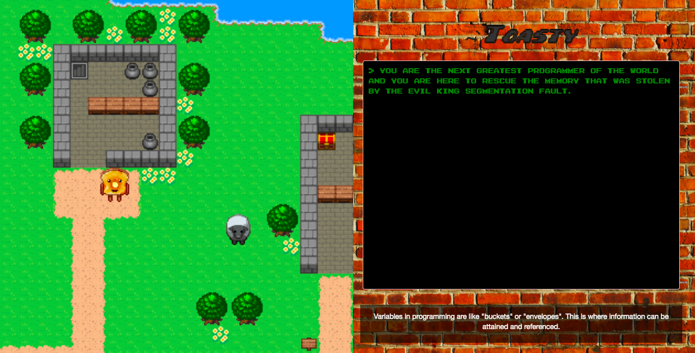

# nsbe-hack

2d web based game where you get to choose your adventure. Each adventure has 
incorporated basic programming problems so that the player can learn little "toasts" of 
computer science.

# Tools
We developed the game using Javascript. Used enchant.js a framework for developing simple games and applications.

# Copyrights for images/sprites used
[Toast sprites](http://www.rpgmakercentral.com/topic/18349-one-cut-studios-free-resources/)
